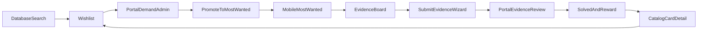

# Most Wanted + Wishlist: redesign vs polish plan

## Audit verdict (your assessment vs codebase)

Your prioritization and product gaps are **mostly right**. Adjustment: this is **not** a greenfield feature rebuild. Core workflows, RPCs, notifications, and page shells already exist. What is missing is **clear product hierarchy, guided UX, admin workbench layout, cross-links, and user-facing language**.

| Surface | Your tier | Code reality | Recommended tier |
|---|---|---|---|
| Mobile MW main | Redesign | Sections mostly present but weak hierarchy / “ACTIVE HUNTS” list-page feel | **Redesign IA + visual hierarchy** (reuse cards/libs) |
| Mobile MW detail | Redesign | Hero, checklist, progress, leads, submit, discuss/wishlist/share already exist | **Strong product redesign** (not rewrite APIs) |
| Mobile submit evidence | Redesign | One long form with step *labels*, not a real wizard | **Redesign as guided wizard** |
| Mobile wishlist list/detail | Redesign | Enriched statuses + CTAs already implemented; UI is generic subpage list | **Redesign presentation** (keep status/CTA logic) |
| Portal wishlist admin | Redesign | Demand cards, promote, merge, disposition exist; still table-first | **Workbench redesign** |
| Portal bounties admin | Redesign | Tabs Active/Evidence/Solved/Rankings + detail/evidence panels exist; no Claims tab | **Workbench redesign + Claims tab** |
| Contributions / Watched / Solved / Rankings | Polish | Functional and close to intended | **Strong polish** |
| Evidence review queue | Polish | Approve / needs info / reject works; preview opens new tab | **Speed polish** |
| Search empty → wishlist | Bridge | Already linked in [`search.tsx`](Codebase/Mobile/App/app/database/search.tsx) | **Small polish** (stronger empty CTA) |
| Catalog card detail MW links | Bridge | Wishlist bookmark only; **no related MW link** | **Bridge build** |
| Notifications | Bridge | Backend kinds + path routing exist; UX/type specificity thin | **Polish + deep-link fixes** |
| Reward claim | Bridge | Solver claim on detail; admin fulfillment status incomplete | **UX + Claims admin tab** |
| “Hunt” terminology | Language | Heavy in [`mostWantedCopy.ts`](Codebase/Mobile/App/constants/mostWantedCopy.ts) / headers | **Pass across mobile UI** |

**Default execution approach:** keep existing Supabase RPCs / lib layers; redesign screens and shared components end-to-end in waves below. Only add backend where UI exposes a missing admin or claim-fulfillment gap.

---

## Wave 0 — Shared foundation (before page rebuilds)

- **Mobile copy taxonomy** in [`mostWantedCopy.ts`](Codebase/Mobile/App/constants/mostWantedCopy.ts): replace user-facing “hunt(s)” with Most Wanted / Wanted Card / Evidence Needed / Solved Item / Community Priority. Keep `hunt` in code identifiers.
- **Shared MW layout primitives** under [`components/most-wanted/`](Codebase/Mobile/App/components/most-wanted/): section scaffold, sticky CTA bar, status/reward/watch row, empty CTA block, wizard chrome — matching existing Figma parchment/brush language from Database/Authenticate.
- **Portal workbench shell**: left list / right inspector pattern consistent with staging review (`StagingReviewLayout`), reused by Wishlist + Bounties.

---

## Wave 1 — Redesign from scratch (priority pages)

### 1. Mobile Most Wanted main — [`mostwanted.tsx`](Codebase/Mobile/App/app/mostwanted/mostwanted.tsx)

Implement strict section order:

1. Header
2. Stats row (already [`WantedStatsRow`](Codebase/Mobile/App/components/most-wanted/WantedStatsRow.tsx))
3. Featured Wanted item
4. Community Priority preview (current rankings slice; rename from bounty/hunts language)
5. Filters / search / sort (move below featured/priority so board feels editorial first)
6. Active Most Wanted list
7. Prominent links: Watched / Contributions / Solved (not tiny text chips)

Keep data loaders as-is (`fetchMostWantedStats`, `fetchFeaturedMostWanted`, `listMostWantedHunts`, `listBountyRankings`).

### 2. Mobile Most Wanted detail — [`[id].tsx`](Codebase/Mobile/App/app/mostwanted/[id].tsx)

Rebuild as an evidence-board composition (reuse existing detail payload):

- Card hero
- Status / reward / watch row (first-class, not secondary chips only)
- Evidence checklist + progress
- Community leads (clearer “submitted so far”)
- Sticky **Submit Evidence** CTA when active
- Secondary: Discussion / Wishlist / Share / View catalog
- Reward panel states: available → claim → claimed (and message when fulfilled pending admin)

Rename “Hunt Detail” header; keep APIs `getMostWantedDetail`, watch, claim, wishlist.

### 3. Mobile Submit Evidence — [`submit.tsx`](Codebase/Mobile/App/app/mostwanted/submit.tsx) + [`SubmitEvidenceForm.tsx`](Codebase/Mobile/App/components/most-wanted/SubmitEvidenceForm.tsx)

Convert labeled single-scroll form into a real 4-step wizard:

1. Choose evidence type (guided descriptions of useful evidence)
2. Upload image and/or source URL (type-aware)
3. Notes/context
4. Review summary + submit

Same `submitMostWantedEvidence` backend; better validation/progress UI.

### 4. Mobile Wishlist list + detail — [`wishlist/index.tsx`](Codebase/Mobile/App/app/database/wishlist/index.tsx), [`wishlist/[id].tsx`](Codebase/Mobile/App/app/database/wishlist/[id].tsx)

Visual + IA redesign on existing enriched statuses (`saved` / `requested` / `under_review` / `promoted_to_most_wanted` / `evidence_needed` / `added_to_database`):

- Status legend and filter chips on list
- Status-forward cards showing MW/database linkage
- Detail CTA stack already present (Authenticate Similar / View MW / View Card / Remove) — make primary/secondary hierarchy obvious and add short “what happens next” copy per status

### 5. Portal Wishlist Demand Admin — [`WishlistPage.tsx`](Codebase/Web/portal/src/pages/WishlistPage.tsx) + [`WishlistDetailPanel.tsx`](Codebase/Web/portal/src/components/WishlistDetailPanel.tsx)

Rebuild as Baxter workbench (backend already has analytics/promote/merge/disposition):

- Demand dashboard strip: top requested, most saved, duplicates, demand score
- Work queue table with filters
- Inspector actions: Promote to Most Wanted, Merge duplicates, Mark below threshold / not a fit, Link to catalog
- Clear promote readiness (already promoted / disposition blocks)

### 6. Portal Bounties / Most Wanted Admin — [`BountiesPage.tsx`](Codebase/Web/portal/src/pages/BountiesPage.tsx) + panels

Workbench redesign with tabs:

- Active Items
- Evidence Review
- Priority Rankings
- Solved / Archived
- **Reward Claims** (new; currently only claim flags on hunt detail)

Detail inspector already covers checklist/links/evidence/watchers/reward/status — tighten layout and admin action grouping. Evidence review: inline image preview, one-keyboard-friendly approve/needs-info/reject, attach-to-catalog feedback.

Backend: reuse `listMostWantedHuntsAdmin`, `listEvidenceAdmin`, `reviewMostWantedEvidenceAdmin`, promote ranking; add a claims list query (filter solved + claim/fulfillment fields) if missing.

---

## Wave 2 — Strong polish (reuse components)

| Page | Keep | Polish |
|---|---|---|
| Contributions | status buckets already match Pending/Approved/Needs info/Rejected | cleaner section headers, resubmit CTA for needs-info |
| Watched | reuse `WantedCard` | empty state + parity with main list cards |
| Solved | `SolvedHuntCard` already shows solver/date/contributors/reward | archive/trophy framing, completed evidence summary |
| Rankings | rank + title + votes + vote controls | clearer status; promote pathway copy |
| Portal Evidence Review | existing panel | inline preview, fewer click steps |

---

## Wave 3 — Bridge UX (workflow glue)

1. **Search empty state** — elevate existing wishlist CTA in [`search.tsx`](Codebase/Mobile/App/app/database/search.tsx) into a full empty-state module (“Can’t find this card?”).
2. **Catalog card detail** — add Related Most Wanted / Add to Wishlist / Authenticate Similar / evidence rating cues in [`card/[id].tsx`](Codebase/Mobile/App/app/database/card/[id].tsx) (new thin lookup by `card_id` → active hunt).
3. **Notifications** — ensure kinds from bridge migration route to correct screens (`/mostwanted/:id`, contributions, wishlist **item** detail when available); improve inbox labels for promoted / evidence outcomes / solved / added-to-database.
4. **Reward claim end-to-end** — mobile claim states + portal Claims tab with admin fulfillment status (`pending` / fulfilled / notes). Extend schema only if fulfillment fields are insufficient for MW rewards (monthly prize fulfillment is separate).

---

## What we will not rebuild

- Supabase hunt/evidence/watch/vote/wishlist enriched RPCs from [`20260713100000_wishlist_most_wanted_bridge.sql`](Codebase/Web/supabase/migrations/20260713100000_wishlist_most_wanted_bridge.sql) and phase-1/2 MW migrations
- Core mobile libs [`lib/most-wanted.ts`](Codebase/Mobile/App/lib/most-wanted.ts), [`lib/wishlist.ts`](Codebase/Mobile/App/lib/wishlist.ts)
- Portal libs [`most-wanted-admin.ts`](Codebase/Web/portal/src/lib/most-wanted-admin.ts), [`wishlist-admin.ts`](Codebase/Web/portal/src/lib/wishlist-admin.ts)

These stay the source of truth; UI is rebuilt around them.

---

## Delivery order (implementation)

1. Wave 0 shared foundation + terminology
2. Mobile MW main → detail → submit wizard
3. Mobile wishlist list/detail
4. Portal wishlist workbench
5. Portal bounties workbench + claims
6. Wave 2 polish screens
7. Wave 3 bridges (catalog, notifications, reward fulfillment, search empty)

Acceptance bar per redesigned page: section structure matches the product story above; loading/empty/error states; actions wired to existing RPCs; no user-facing “hunt” in mobile UI; Baxter can promote/merge/disposition/review without hunting through raw tables.
